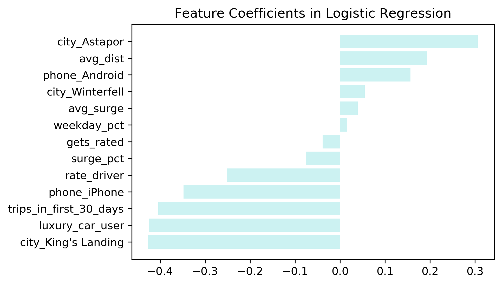
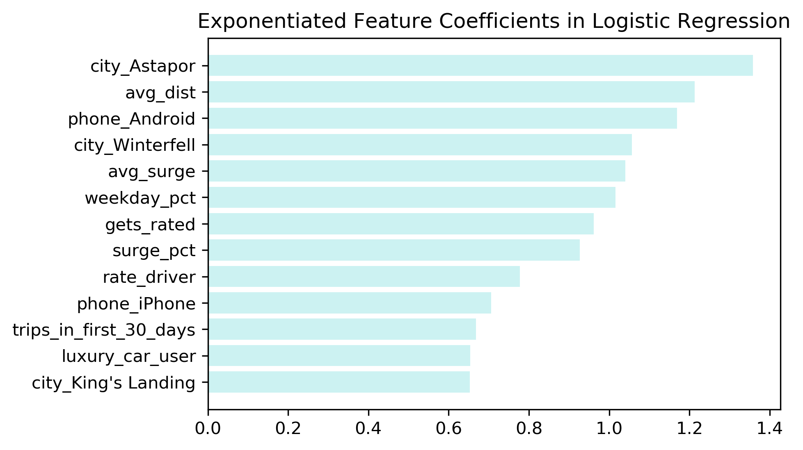
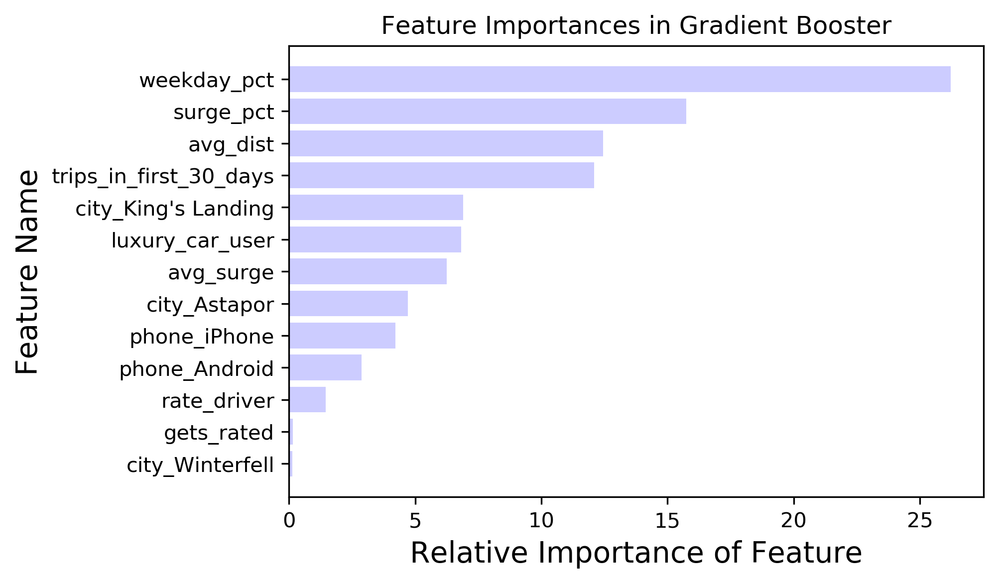
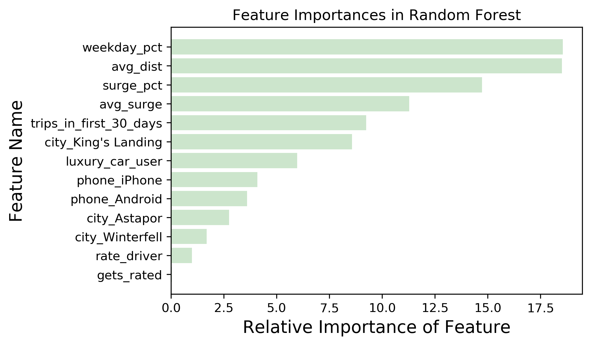
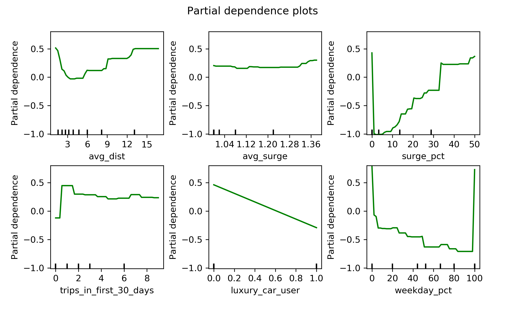
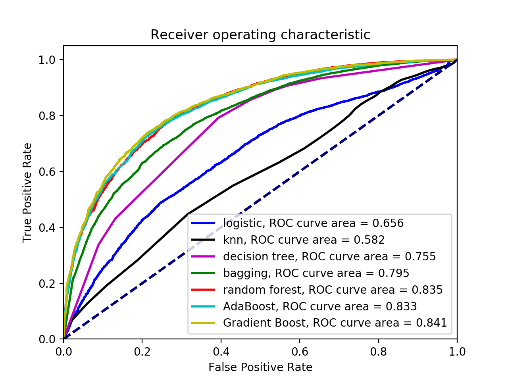

DSI case study: Drew T., Chris S. Tyson W.

### approach
 - __company priority__: retain users, if we think they'll churn, give an incentive
 - __company action__: if p(churn) > 0.8 --> spend $10 on incentive
 - __cost/benefit__: incentive costs $10, c.l.v. valued at $100

cost-benefit matrix:

 |           |predicted 0 | predicted 1(churn) |
 |---------- |---------- |----------- |
 |__actual 0__   |  0 |  -10|
 |__actual 1(churn)__   |  0| 20 (-10 + 100*.2)|

 Assumes 20% retention rate with incentive

__precision__ is our target score metric:
 -  many people will churn, so we don't care about getting all of them, but of the people who will churn, we want to predict right so we don't waste incentive funds.

### picking the 'churn' target
pick by last active day
 -  June 1 (30 days ago): 62% of users have churned
 -  May 1 (60 days ago): 47% of users haves churned

### evaluating models

|        model | methods | accuracy | precision |
|---------- |---------- |----------- | ----------|
| logistic regression |  cross-val, cv=5 |  0.745| 0.734 |
| knn | 50 neighbors | 0.786 | 0.753 |
| decision tree  | simple tree | 0.712 | 0.720 |
| bagging | 100 trees | 0.735 | 0.782|
| random forest | grid searched | 0.769 | 0.789 |
| AdaBoost | defaults | 0.761 | 0.782 |
| gradient boost | defaults | 0.770 | 0.794 |
| gradient boost | grid searched | 0.781 | 0.802 |
| SVM | kernel=linear, C=5 | 0.74 | 0.69 |
| SVM | kernal=rbf, C=1, gamma=0.1 | 0.607 | 0.575 |
| SVM | kernal=poly, defaults | 0.613 | 0.594 |

_notes on modeling_
 - __Best models__: Boosted models and random forest preformed the best.
   - Gradient boost performed quite well out-of-the-box. A grid search of 2800
parameter combinations that took 250 minutes improved precision by only 0.8%.
 - __Fastest models__: KNN did better than logistic regression and trained quickly, however boosted models or random forest performed 5-8% better.
 - For __tree methods__, each level of added complexity/stochasticity to reduce
variance paid off in test precision:
   - random forest > bagging > decision tree
 - __Kernal methods__ tested here did not do very well in predicting this classification, despite very long computation times.

### Feature Importances
#### Logistic Regression Coefficients
|features: |avg_dist|avg_surge|surge_pct|trips_in_first_30_days|gets_rated|
|--|--|--|--|--|--|
|Beta|0.193|0.0396| -0.0759|-0.404|-0.039|
|features:|luxury_car_user|weekday_pct|city_Astapor|city_King's Landing|
|Beta|-0.425|  0.016|0.306|-0.426|
|features|city_Winterfell|phone_Android|phone_iPhone|rate_driver|
|Beta|0.055|  0.157| -0.347|   -0.252|

Logistic regression coefficients best_params = [x0, x0, x1 ... xn] represent the __*log likelihood*__ of the target class being positive (e.g. _churn_) based on feature xi.

Hence, it is more useful to look at the coeffients

#### Feature Importances from Gradient Boost and Random Forest

Features ordered by importance to fitting the model to the training data:

Interesting to note that boosting and tree method selected a key group of features as most important, in similar order:
 - weekday percent
 - surge percent
 - avg distance
 - trips in first 30 days
 - average surge
 - city: King's Landing
 - luxury car user

___

___

___
=======
__Partial dependency plots__ can be used to interpret each feature's contribution to the the effect on the target class.

### Choosing a model
A __Receiver Operating Characteristic__ plot allows us to assess performance in terms of precision. The area under the curve = the accuracy (1 would be a perfect model, 0.5 would be a useless model). __why are auc's better than our accuracy scores?__

 - To maximize false positives and minimize false negatives, a random forest or boosted model with a high probability threshold will yield the best precision.

### Strategy for applying the model
>>>>>>> 4ebd0c9386d8456a763d72495415f8697ae0d43a

___

___

